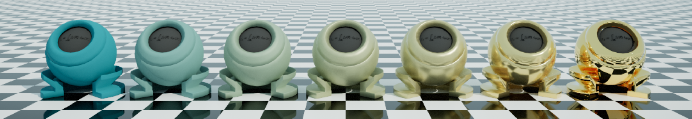

# Cogwheel - Rendering Engine with a focus on composability.

Yet another small engine that I hope to use to experiment with the latest and greatest in rasterization, ray tracing and image processing.

References
* Stingray blogspot:
    * [Events](http://bitsquid.blogspot.dk/2009/12/events.html)
    * [Unique ID Generation](http://bitsquid.blogspot.de/2011/09/managing-decoupling-part-4-id-lookup.html)
    * [Data Oriented Entity System](http://bitsquid.blogspot.dk/2014/08/building-data-oriented-entity-system.html)
* DirectX11
    * [Direct3D 11 Programming Guide](https://msdn.microsoft.com/en-us/library/windows/desktop/ff476345(v=vs.85).aspx)
    * [Direct3D 11 Tutorial](https://www.braynzarsoft.net/viewtutorial/q16390-braynzar-soft-directx-11-tutorials)
    * [Low-Overhead Rendering with Direct3D](https://developer.nvidia.com/sites/default/files/akamai/gameworks/events/gdc14/GDC_14_Efficient%20Work%20Submission%20in%20Direct3D.pdf)
* Path tracing
    * [Eric Heitz papers](https://eheitzresearch.wordpress.com/research/)
    * [Toshiya Hachisuka](http://www.ci.i.u-tokyo.ac.jp/~hachisuka/)
    * [Veach Thesis](https://graphics.stanford.edu/papers/veach_thesis/thesis.pdf)
