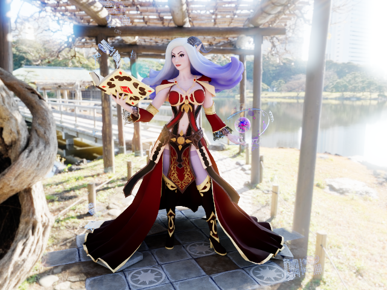

# Metallic-Roughness Shading Model in Bifrost3D.

Kalestra, material scene, scifi helmet and SanMiguel

## Introduction
When selecting a shading model for Bifrost3D an obvious choice is the metallic-roughness model supported by several 3D model formats, asset pipelines and 3D engines, such as Substance Designer, glTF and Unreal Engine 4. As discussed in Real Shading in Unreal Engine 4 [1] the model lives up to multiple pleasing _principles_, below a few are summarized.

* **Low complexity** refers to a low number of easy to understand material parameters, making it easy to work and experiment with the model. Parameters should ideally be perceptually orthogonal, meaning that changing one parameter has no perceptual influence on another parameter. The importance can be illustrated with a counterexample; when multiple scattering isn't taken into account by a microfacet a rough material will be darker than a smooth material due to the energy lost to multiple scattering and thus the tint might have to be readjusted after changing roughness to maintain the overall visual appearance. See figure 1.

* **Perceptually linear** essentially means that linearly interpolating the result of evluation two models should correspond (more or less) to evluating a model whose parameters are a linear interpolation of the input parameters to two models. Or _lerp(eval(BRDF0), eval(BRDF1)) = eval(BRDF2)_, where _BRDF2.params = lerp(BRDF0.params, BRDF1,params)_

* **Efficient to evaluate** is a must for real-time performance in scenes with many light sources. The most expensive part of the metallic-roughness shading model is evaluating the GGX microfacet model. Luckily a lot of good approximations to GGX can be found in the Unreal Engine 4 source code [2].

In addition to fullfilling the above principles and the additional ones outlined in Physically-Based Shading at Disney[0] and Real Shading in Unreal Engine 4[1], a physically based shading model should also obey the following properties.

* **Positivity:**

   

* **Helmholtz reciprocity:** 

   

* **Energy conservation:** 

   

## Parameters

The parameters for the metallic-roughness shading model are the following.

* **Tint:** The overall tint or color of the material.
* **Roughness:** Adjusts how rough or smooth the material appears.
* **Metallic:** Whether or not the material is metallic. From the point of view of an artist this should be perceived as a binary parameter, either 1 for metals or 0 for dielectrics. Inside the rendering pipeline this will be linearly interpolated, fx when rendering a dirty showel and the material transitions from iron (metal) to dirt (dielectric).
* **Specularity:** _Debating whether to add specularity or not._

## Implementation
Construction.
### Diffuse term
### Specular term

### Energy Conservation
* Hot white/grey room.
* Approximate microfacet interreflection by assuming no energy loss, i.e. white is white! Assume diffuse distribution and add interreflection to diffuse.
* Additionally this adds the nice property to the shading model that  roughness and tint become orthogonal
* Implement metallic by linear interpolation of dielectric and conductor parameters that both obey energy conservation and because the shading model is perceptually linear this gives us a good visually pleasing result.

LaTeX https://stackoverflow.com/questions/11256433/how-to-show-math-equations-in-general-githubs-markdownnot-githubs-blog

### Reciprocity
* Help, we broke bidirectional methods
*** Try to reintroduce the heimholtz reciprocity. Then diffuse * (1 - rho) can't be precomputed anymore. Do it in a separate material, so I can swap back and forth.
*** Fix and show images with hopefully no perceptual difference. Diff the images.

## Conclusion
While some basic realisations of the metallic-roughness shading model claim to be physically based, they actually do not conserve energy, which can lead to strong highlights at grazing angles, where the diffuse and specular directional-hemispherical reflectance function adds up to more than one. These strong highlights can be removed by enforcing energy conservation, which produces more visually pleasing images with less high frequent visual clutter.
This has imperically been shown to be possible without sacrificing any of the other two rules of BRDFs??

## Future work
While the current metallic-roughness shading model covers most usecases, there are exceptions that should be handled in future extensions. A clear coat layer with separat roughness for car paint and wet surfaces, anisotrophy for brushed metals and subsurface scattering for skin rendering and realistic rendering of outdoor scenes. This would obviously conflict with the low complexity requirement from above and a balance will have to be found.
The current approximation of multiple scattering of microfacet surfaces could also be improved by fitting to the results of Heitz et al. [2], but while that would produce more physically accurate scattering, it would sacrifice the orthogonality or roughness and tint, as more rough materials would again be darker than their smooth counterparts.

## Links

[0] [Physically-Based Shading at Disney](https://disney-animation.s3.amazonaws.com/library/s2012_pbs_disney_brdf_notes_v2.pdf)

[1] [Real Shading in Unreal Engine 4](https://blog.selfshadow.com/publications/s2013-shading-course/karis/s2013_pbs_epic_notes_v2.pdf)

[2] [Unreal Engine 4 source](https://github.com/EpicGames/UnrealEngine)

[3] [Multiple-Scattering Microfacet BSDFs with the Smith Model](https://eheitzresearch.wordpress.com/240-2/)

[4] [glTF BRDF Implementation](https://github.com/KhronosGroup/glTF/tree/master/specification/2.0#appendix-b-brdf-implementation)

[5] [Dassault Systems: Enterprise PBR Shading Model](https://github.com/DassaultSystemes-Technology/EnterprisePBRShadingModel)

[6] [Kalestra the Sorceress by Alena](https://sketchfab.com/models/87637fba3f7c41d2bf23df2987185102)

[7] [Bidirectional Reflectance Distribution Function](https://en.wikipedia.org/wiki/Bidirectional_reflectance_distribution_function)